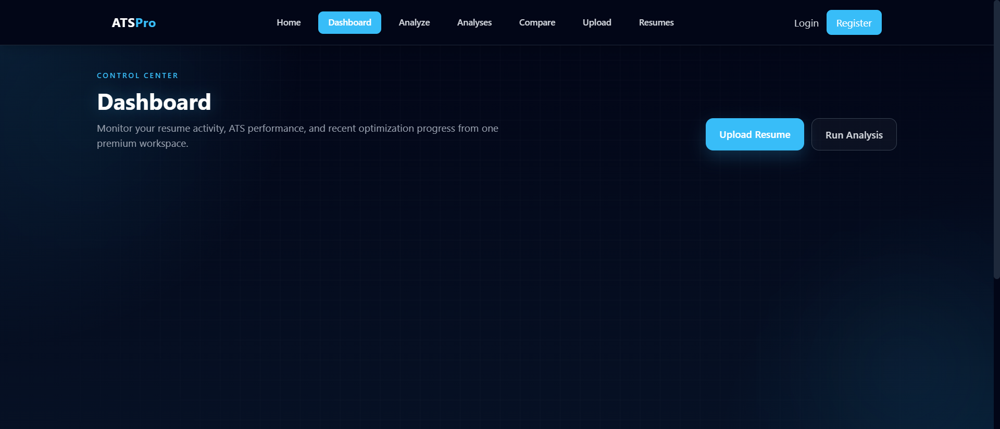
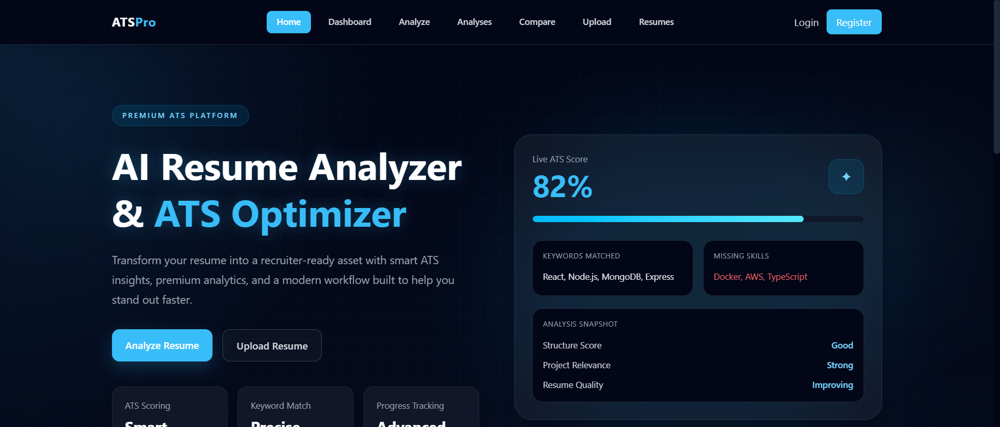
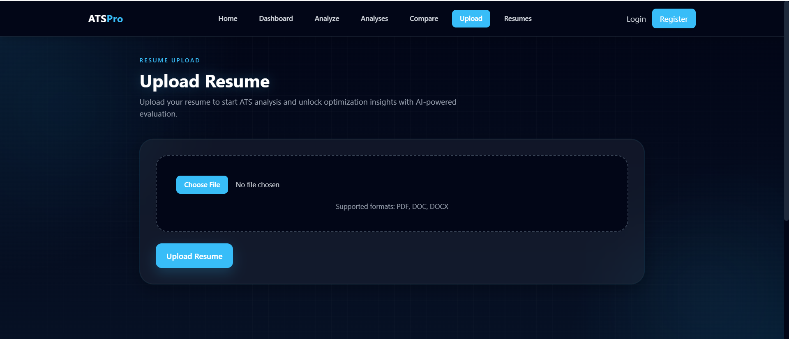
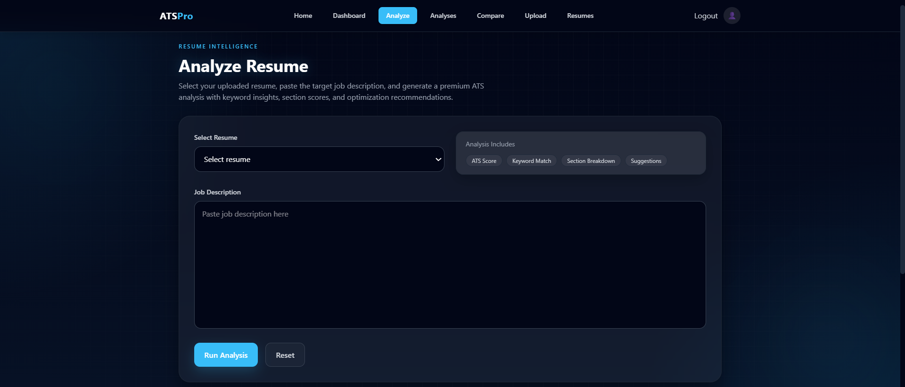

# AI Resume Analyzer (ATS Optimization Tool)

## Overview

AI Resume Analyzer is a MERN stack tool that checks how well a resume performs against ATS (Applicant Tracking System) rules.

In simple terms: you upload a resume + job description, and it tells you how likely your resume is to pass automated screening, along with what's missing.

Most resumes don't even reach a recruiter because ATS filters them out early. This project focuses on fixing that gap by breaking down keywords, structure, and content alignment.

## What it does

- Takes a resume (PDF upload)
- Extracts and parses content
- Compares it with a job description
- Calculates an ATS match score
- Highlights missing keywords
- Gives practical improvement suggestions instead of generic advice
- Runs analysis in real time

## Live Demo

You can try it here: https://ats-kappa-olive.vercel.app/

## Tech Stack

**Frontend**
- React.js
- Tailwind CSS

**Backend**
- Node.js
- Express.js

**Database**
- MongoDB

**Core Libraries / Services**
- [Name your PDF parsing library here — e.g. pdf-parse] for resume extraction
- [Confirm: OpenAI API, or a local NLP keyword-matching approach — pick one, this shouldn't be an "or"]
- Axios for API communication

## How it works (high level)

1. User uploads a resume
2. Backend extracts raw text from PDF
3. Job description text is compared with resume content
4. Keyword overlap + relevance scoring is calculated
5. System returns:
   - ATS score
   - Missing keywords
   - Suggestions to improve resume

## Setup Instructions

Clone the repo:
```
git clone https://github.com/codedByAryan/ATS.git
cd ATS
```

Install dependencies:

Frontend:
```
cd Frontend
npm install
```

Backend:
```
cd Backend
npm install
```

Run locally:

Backend:
```
cd Backend
node server.js
```

Frontend:
```
cd Frontend
npm run dev
```

## API Endpoints

| Method | Endpoint       | What it does           |
|--------|----------------|-------------------------|
| POST   | `/api/upload`  | Upload resume file      |
| POST   | `/api/analyze` | Run ATS analysis        |
| GET    | `/api/results` | Fetch saved results     |

## Screenshots

<p align="center">
  
  
</p>

<p align="center">
  
  
</p>

## Contributing

If you want to improve this:

1. Fork it
2. Create a feature branch
   ```
   git checkout -b feature/new-feature
   ```
3. Make your changes
4. Push and open a PR

Keep changes focused and readable — no unnecessary complexity.

## Author

**Aryan Chauhan**
GitHub: https://github.com/codedByAryan

## Support

If you find this useful, star the repo. That's it.